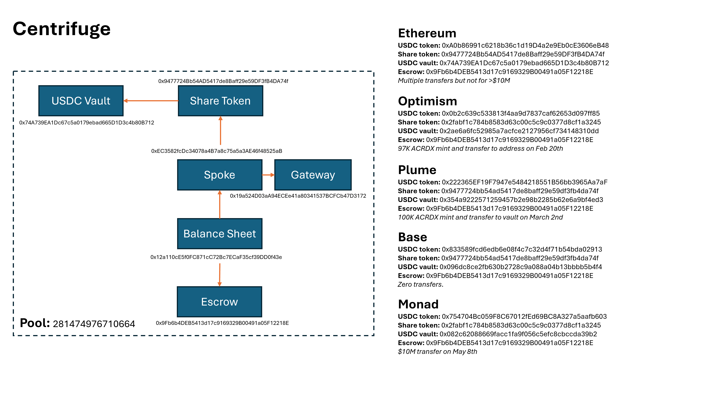
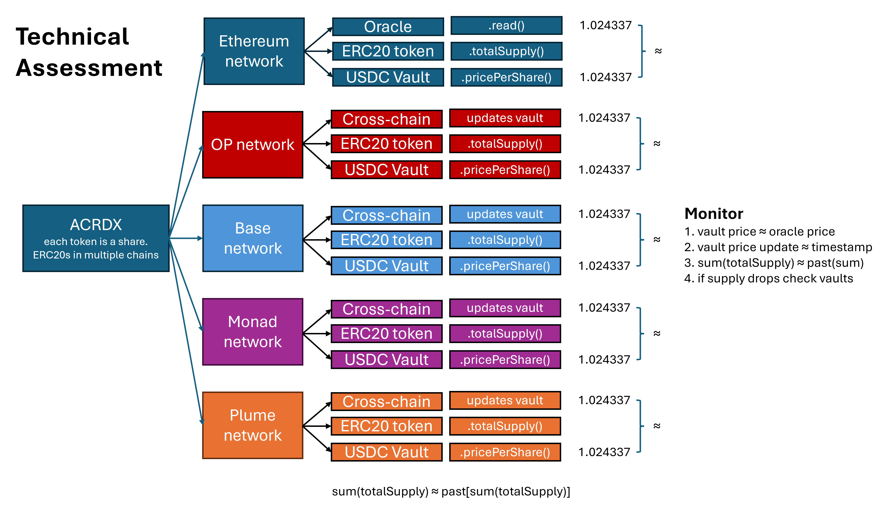

# Monitoring ACRDX

## What is ACRDX

ACRDX is a ShareToken smart contract representing the Tokenized Apollo Diversified Credit Fund issued by Anemoy Capital SPC Limited and deployed using the Centrifuge tokenization platform. The contract inherits a ERC-20 token structure where each one represents a unit of the fund's shares, therefore the `totalSupply` function reflects the total number of issued shares.

### Centrifuge

The Centrifuge platform allows third parties to deploy Real World Assets (RWAs) using their protocol. Centrifuge centralizes all deployed tokens in a set of smart contracts (Hub, Spoke per chain deployment) that RWAs interact with to manage and track their assets. For more information please read the [docs](https://docs.centrifuge.io/developer/protocol/overview/). The following image shows the Centrifuge architecture from a ACRDX point of view:

### ACRDX accross diferent networks

ACRDX is a single RWA protocol that has deployments in 5 different networks: Ethereum, Optimism, Monad, Base and Plume. The total amount of ACRDX on-chain shares is represented by the sum of the total supply across these networks.

Each network has its own share token deployment and their respective vault (USDC vaults are the only currently active vaults in the different networks). Each vault has a `pricePerShare()` function that returns the current share price from a [Chronicle Labs oracle](https://chroniclelabs.org/dashboard/proof-of-asset/anemoy-tokenized-apollo-acrdx). This oracle performs a Proof of Assets off-chain mechanism and publishes the share price daily in Ethereum mainnet. This price is propagated through a cross-chain messaging protocol using Axelar.

There are escrow contracts deployed in each network that contain crypto assets related to the ACRDX protocol. These contracts help manage and secure the assets before they are allocated to the respective vaults. They act as an entrypoint for depositors to mint and transfer tokens to their respective addresses.

## How to Monitor ACRDX

To monitor ACRDX, we track the on-chain total supply of the token and multiply it by the oracle price provided by Chronicle Labs and their Proof Of Assets mechanism (it is a trusted mechanism). We follow up token supply and oracle price accross a time frame in order to check for anomalies. There is only one Chronicle Labs oracle and each network USDC vault was deployed using Axelar (cross-chain communication) so I assume the price feed is coming from the only Chronicle Labs oracle deployed on Ethereum mainnet.

### August 10th incident

On August 10th 2026, 12 million share tokens on the Plume network were burned reducing Plume's total supply from 42 million to 30 million in a single transaction. The transaction authorized moving 12M tokens from the ALM Proxy contract to the zero address (0x000). There was no clear redemption or payment in the Plume's transaction so for outside observers it looked like someone had burned 12M tokens.

There was no considerable oracle price increase following the burn in any network, indicating that the market value of the underlying assets did not change despite the token supply reduction. So the burn event had to had a cash settlement somewhere. The escrow contracts did not show any money movement transactions of at amount.

By researching the ALMProxy contract, I realized that it was part of the Sky's Atlas system. Looking further, I found that Sky had initially committed $50 million dollars to ACRDX and I assumed it was through Atlas. I researched the Sky entities in the different networks in order to find a cash settlement. Finally, I found that a Grove AMLProxy address on Ethereum mainnet had received $12M dollars from a Coinbase Prime wallet on August 10th 2026 and used it to pay USDS debt. The amount paid was equal to the burned shares times the oracle price at that time.

## Conclusions

1. It is important to monitor token supply and oracle prices daily for this type of protocols. It allows to find anomalies and investigate further more

2. It is important to consider that some RWA tokens like ACRDX are deployed in different networks and in some cases there are no atomic settlement. For example the August 10th redemption happened on Plume and Ethereum mainnet from a custodial Coinbase address.

3. It is important to define acceptance thresholds so small discrepancies in oracle prices or timestamp do not raise false alarms that cause innecesary noise in the long run.

4. It is important to have trusted collaborators and data providers in order to ensure a correct monitoring. The Chronicle Labs Proof of Assets mechanism allow us to rely on an on-chain number rather than looking for off-chain evidence that might be impossible to access.

## Data sources and notes

All this information was fetched on September 7th 2026

1. [Chronicle Labs Proof of Assets:](https://chroniclelabs.org/dashboard/proof-of-asset/anemoy-tokenized-apollo-acrdx): shows:
   - Share token price: $1.024337
   - Outstanding shares: 30,472,585
   - Net Asset Value (NAV): $31,2140,200 (share token price * outstanding shares = $31,214,196)
   - NAV calculation frequency: daily
   - This repo monitoring results: shares * oracle price = $31,214,197.40. There is a $1.40 discrepancy compared to the reported NAV.
   - **IMPORTANT:** shows 42,634,425 token supply on August 3rd
   - **IMPORTANT:** The ACRDX Transfers Analytics only show [one tx](https://explorer.plume.org/tx/0x9436d124e15bea9def739ab01daf192f8c70b87d16787bbdddba2868ced5008e?tab=state) with 12,020,502 being burned to 0x0 in the Plume network on August 10th 2026. Total supply before: 32,222,245. Total supply after: 20,201,743
   - **IMPORTANT:** The sender of the burn tx executed a similar tx burning 17M tokens in May 12th. He performs a 1 token test tx before executing the large burns (17M and 12M).

2. [Centrifuge Pool interface](https://app.centrifuge.io/pool/281474976710664): shows:
   - Accepts stablecoins: USDC, USDS, AUSD, USDT
   - If you interact with the ACRDX contract.vault(asset) function, you will see that the only active vault is for USDC.
   - **IMPORTANT:** shows $42,362,030 as Apollo Diversified Credit Market Value as of July 20, 2026. Maybe it is connected to the token supply event in August 3rd.

3. [Grove deploys $50M to ACRDX](https://centrifuge.io/blog/acrdx-launch-on-centrifuge): shows
   - ACRDX was launched using Centrifuge intrastructure and in the Plume blockchain (the other networks are not mentioned)
   - Grove committed $50M to ACRDX at the beginning. The 12M and 17M burned tokens belonged to AMLProxy (part of Grove/Sky - Atlas framework)

4. [Financial Sky Ecosystem Dashboard](https://financial.skyeco.com/primes/grove/allocations/0x9477724bb54ad5417de8baff29e59df3fb4da74f?wallet_address=0x1db91ad50446a671e2231f77e00948e68876f812&network=plume&tab=events)

5. [Grove AMLProxy Ethereum address](https://etherscan.io/address/0x491edfb0b8b608044e227225c715981a30f3a44e):
   - Received $12,263,706.477 on August 10th in Ethereum mainnet from a Coinbase Prime 1 address. [Tx details here](https://etherscan.io/tx/0x66cb3d9d68010cfeb6e1949215dbea5cc18a21c0e3e6be94321272230c70f899). If you multiply that day oracle price $1.020232 by the number of burned tokens 12,020,502 you get $12,263,700.79 which has a $6.32 difference with the paid amount in USDC

6. [Typescript monitoring tool](../README.md): shows
   - for exact daily monitoring, the script takes around ~5 minutes to finish.
   - `shares.json` (ETH block number: 25722135) shows the Plume burn incident. $42M before, $30M after.
   - `shares.json` (ETH block number: 25722135) shows another burn in Ethereum. 378,869 tokens before, 261,058 after. 117,810 burned tokens.
   - The Alchemy Monad API cannot get historical eth_call data. An open RPC endpoint is used instead.
